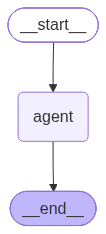

# 🤖 Agentic E-Commerce AI Assistant

An intelligent e-commerce assistant powered by Large Language Models (LLMs), Agentic AI, RAG, tool calling, and memory.

The system is designed to understand user requests, retrieve relevant information, use specialized tools, maintain conversational context, and handle multi-step tasks in an e-commerce environment.

---

## 🚀 Overview

The Agentic E-Commerce AI Assistant combines Large Language Models with an agent-based architecture to provide intelligent and context-aware assistance for e-commerce tasks.

Instead of behaving like a traditional chatbot, the system can:

- Understand natural language requests
- Reason about user queries
- Retrieve relevant information from a knowledge base
- Use specialized tools
- Maintain conversation history
- Store long-term information
- Perform multi-step tasks
- Work with e-commerce product data

---

## ✨ Features

### 🧠 Agentic AI

The system uses an agent-based architecture that allows the LLM to reason about the user's request and decide which actions or tools should be used.

### 🔎 Retrieval-Augmented Generation (RAG)

The assistant can retrieve relevant information from a knowledge base before generating an answer.

RAG helps the system provide responses based on project-specific information instead of relying only on the LLM's general knowledge.

### 🛠️ Tool Calling

The agent can use specialized tools to perform different operations and retrieve information required to answer user requests.

### 💾 Short-Term Memory

Conversation history is maintained so the assistant can understand previous messages and provide context-aware responses.

### 🧠 Long-Term Memory

The system includes long-term memory capabilities for storing and retrieving useful information across conversations.

### 🛍️ E-Commerce Support

The assistant works with product information and can help users interact with e-commerce data through natural language.

### 🔗 LangGraph Architecture

LangGraph is used to organize the agent workflow and coordinate different components such as the LLM, tools, retrieval, and memory.

### 🎨 Frontend

A dedicated frontend interface is included to provide users with an interactive way to communicate with the AI assistant.

---

## 🏗️ System Architecture

The project follows an agentic workflow where the user's request passes through the AI agent and the required components are selected dynamically.



### Main Components

```text
User
  │
  ▼
Frontend
  │
  ▼
AI Agent
  │
  ├── LLM
  │
  ├── RAG
  │    └── Knowledge Base
  │
  ├── Tools
  │
  ├── Short-Term Memory
  │
  └── Long-Term Memory
  │
  ▼
Final Response
```

---

## 🧩 Project Components

| Component | Description |
|---|---|
| `agent.py` | Main agent logic |
| `app.py` | Application entry point |
| `graph.py` | LangGraph workflow |
| `rag.py` | Retrieval-Augmented Generation |
| `tools.py` | Tools available to the agent |
| `memory.py` | Short-term conversation memory |
| `long_term_memory.py` | Long-term memory functionality |
| `prompts.py` | LLM prompts and instructions |
| `schemas.py` | Data schemas and structured models |
| `logging_config.py` | Logging configuration |
| `litellm_config.yaml` | LLM configuration |
| `products.csv` | E-commerce product data |
| `knowledge/` | Knowledge base documents |
| `frontend/` | User interface |
| `langgraph.png` | Agent architecture diagram |
| `requirements.txt` | Python dependencies |

---

## 🛠️ Technologies

### Artificial Intelligence

- Large Language Models (LLMs)
- Agentic AI
- Retrieval-Augmented Generation (RAG)
- Tool Calling
- Natural Language Processing (NLP)

### Frameworks & Libraries

- Python
- LangChain
- LangGraph
- LiteLLM
- ChromaDB

### Data & Storage

- CSV
- Vector Database
- SQLite
- Pandas

### Frontend

- Web-based frontend
- AI chat interface

---

## 🔄 How It Works

The system follows an agentic workflow:

```text
User Request
     │
     ▼
Frontend
     │
     ▼
AI Agent
     │
     ▼
LLM analyzes the request
     │
     ├──────────────┐
     ▼              ▼
   RAG            Tools
     │              │
     └──────┬───────┘
            ▼
         Memory
            │
            ▼
      Final Response
```

The agent dynamically determines whether the request requires:

- Direct LLM reasoning
- Knowledge retrieval
- Tool execution
- Conversation memory
- Long-term memory

---

## 🔎 RAG Pipeline

The Retrieval-Augmented Generation pipeline allows the assistant to retrieve project-specific knowledge before generating responses.

```text
Knowledge Documents
        │
        ▼
Document Processing
        │
        ▼
Text Chunking
        │
        ▼
Embeddings
        │
        ▼
ChromaDB
        │
        ▼
Relevant Documents
        │
        ▼
LLM
        │
        ▼
Context-Aware Response
```

This approach helps ground responses in the information available within the project's knowledge base.

---

## 💾 Memory System

The project uses both short-term and long-term memory.

### Short-Term Memory

Short-term memory maintains the context of the current conversation, allowing the assistant to understand previous messages.

```text
User Message
      │
      ▼
Conversation History
      │
      ▼
AI Agent
      │
      ▼
Context-Aware Response
```

### Long-Term Memory

Long-term memory allows useful information to be stored and retrieved across interactions.

```text
User Interaction
      │
      ▼
Memory Processing
      │
      ▼
Long-Term Storage
      │
      ▼
Future Retrieval
```

---

## 🛍️ E-Commerce Capabilities

The assistant works with e-commerce product information and allows users to interact with product data using natural language.

Example queries:

```text
"Show me products related to laptops."

"Find products within my budget."

"What products are available?"

"Compare these products."

"Tell me more about this product."
```

The exact capabilities depend on the tools and data implemented in the current version of the project.

---

## 📂 Project Structure

```text
Agentic-E-Commerce-AI-Assistant/
│
├── frontend/
│   └── ...
│
├── knowledge/
│   └── ...
│
├── agent.py
├── app.py
├── graph.py
├── litellm_config.yaml
├── logging_config.py
├── long_term_memory.py
├── memory.py
├── products.csv
├── prompts.py
├── rag.py
├── schemas.py
├── tools.py
│
├── langgraph.png
├── requirements.txt
├── .gitignore
└── README.md
```

---

## ⚙️ Installation

### 1. Clone the Repository

```bash
git clone https://github.com/mamer635/Agentic-E-Commerce-AI-Assistant.git
```

### 2. Navigate to the Project Directory

```bash
cd Agentic-E-Commerce-AI-Assistant
```

### 3. Create a Virtual Environment

```bash
python -m venv .venv
```

### 4. Activate the Virtual Environment

#### Windows

```bash
.venv\Scripts\activate
```

#### Linux / macOS

```bash
source .venv/bin/activate
```

### 5. Install Dependencies

```bash
pip install -r requirements.txt
```

---

## 🔐 Environment Variables

API keys and other sensitive credentials should never be committed to GitHub.

Create a local `.env` file and add the required credentials.

Example:

```env
LLM_API_KEY=your_api_key_here
```

Depending on the selected LLM provider, additional environment variables may be required.

Make sure `.env` is included in `.gitignore`.

---

## ▶️ Running the Project

After installing the dependencies and configuring the required environment variables, run the application:

```bash
python app.py
```

If the frontend requires a separate command, follow the instructions provided inside the `frontend` directory.

---

## 📊 Data

The project includes:

### `products.csv`

Contains e-commerce product information used by the application.

### `knowledge/`

Contains documents used by the Retrieval-Augmented Generation system.

---

## 🧪 Example Interaction

```text
User:
"I'm looking for a laptop suitable for programming."

        │
        ▼

AI Agent:
Analyzes the user's request

        │
        ▼

RAG / Tools:
Retrieves relevant product information

        │
        ▼

AI Agent:
Processes the retrieved information

        │
        ▼

LLM:
Generates the final response

        │
        ▼

Assistant:
Returns a context-aware recommendation
```

---

## 🔐 Security

Never upload sensitive information to GitHub.

Do not commit:

- API keys
- Passwords
- `.env` files
- Private credentials
- Local databases
- Runtime logs
- Generated vector database files
- Temporary Python files

The `.gitignore` file is used to exclude unnecessary and sensitive files from version control.

---

## 🚀 Future Improvements

Potential improvements for future versions include:

- Advanced product recommendation
- Product comparison
- Improved long-term memory
- Multi-agent collaboration
- User authentication
- User preference learning
- Cloud deployment
- Voice interaction
- Multilingual support
- Advanced agent evaluation
- Monitoring and observability
- Personalized shopping experiences

---

## 🎯 Project Goals

The main goal of this project is to demonstrate how modern LLM-based systems can move beyond traditional question-answering and become agentic applications capable of:

- Reasoning
- Retrieving information
- Using tools
- Maintaining memory
- Executing multi-step workflows
- Working with structured and unstructured data
- Supporting e-commerce use cases

---

## 👨‍💻 Author

**Mohamed Yasser**

AI & Machine Learning Enthusiast

### Areas of Interest

- Artificial Intelligence
- Machine Learning
- Deep Learning
- Large Language Models (LLMs)
- Generative AI
- Agentic AI
- Data Science
- Computer Vision
- Natural Language Processing

---

## ⭐ Support

If you find this project interesting or useful, consider giving the repository a ⭐ on GitHub.

Thank you for checking out the project!
